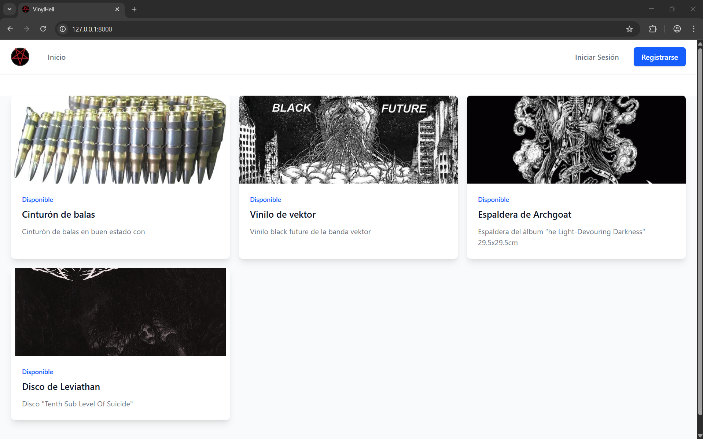
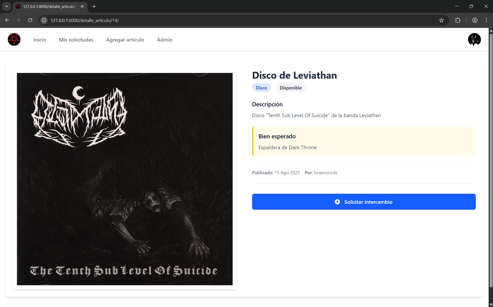
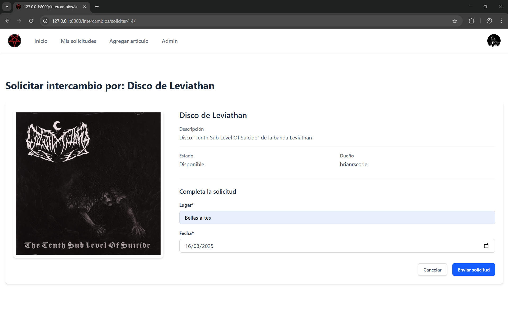
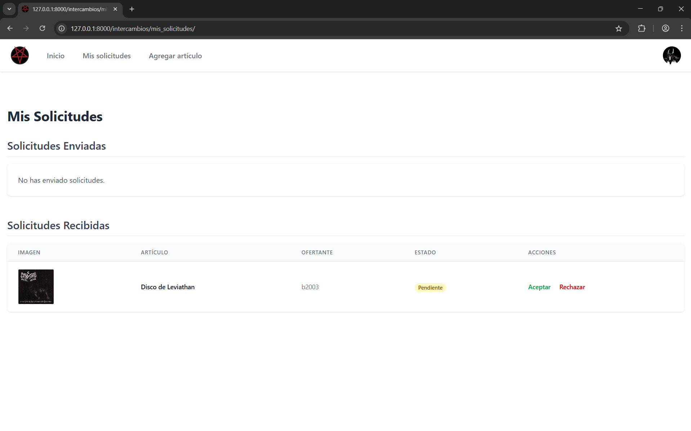

# VinylHell

<p align="center">
   
</p>

VinylHell es una plataforma web para el intercambio de artículos entre la comunidad del metal, rock, punk, goth, etc. Permite a los usuarios publicar artículos que deseen intercambiar, buscar artículos de otros usuarios y gestionar solicitudes de intercambio.

## Características Principales

- **Autenticación de Usuarios**: Registro e inicio de sesión con autenticación segura.
- **Gestión de Artículos**: Publica, edita y elimina artículos para intercambiar.
- **Sistema de Intercambios**: Envía y recibe solicitudes de intercambio con otros usuarios.


## Requisitos Previos

- Python 3.8 o superior
- Node.js y npm (para Tailwind CSS)

## Instalación

1. **Clonar el repositorio**:
   ```bash
   git clone https://github.com/brianrscode/vinylhell.git
   cd vinylhell
   ```

2. **Crear un entorno virtual (recomendado)**:
   ```bash
   python -m venv venv
   ```

3. **Activa el entorno virtual**
    - En Windows:

    ```bash
    venv\Scripts\activate
    ```

    - En macOS y Linux:

    ```bash
    source venv/bin/activate
    ```

4. **Instalar dependencias**:
   ```bash
   pip install -r requirements.txt
   ```

5. **Configuración del entorno**:
   - Crear un archivo `.env` en la raíz del proyecto con las siguientes variables:
     ```
     SECRET_KEY=tu_clave_secreta_aqui
     DEBUG=True
     ALLOWED_HOSTS=
     DB_NAME=
     ```

6. **Aplicar migraciones**:
   ```bash
   python manage.py migrate
   ```

7. **Crear un superusuario (opcional)**:
   ```bash
   python manage.py createsuperuser
   ```

8. **Iniciar el servidor de desarrollo**:
   ```bash
   python manage.py runserver
   ```

9. **Inicia el servidor de tailwind**:
   ```bash
   python manage.py tailwind start
   ```

10. **Acceder a la aplicación**:
   Abre tu navegador y ve a `http://127.0.0.1:8000/`


## Capturas de pantalla

<table>
   <tr>
      <td>
         
      </td>
      <td>
         
      </td>
   </tr>
   <tr>
      <td>
         
      </td>
      <td>
         
      </td>
   </tr>
</table>